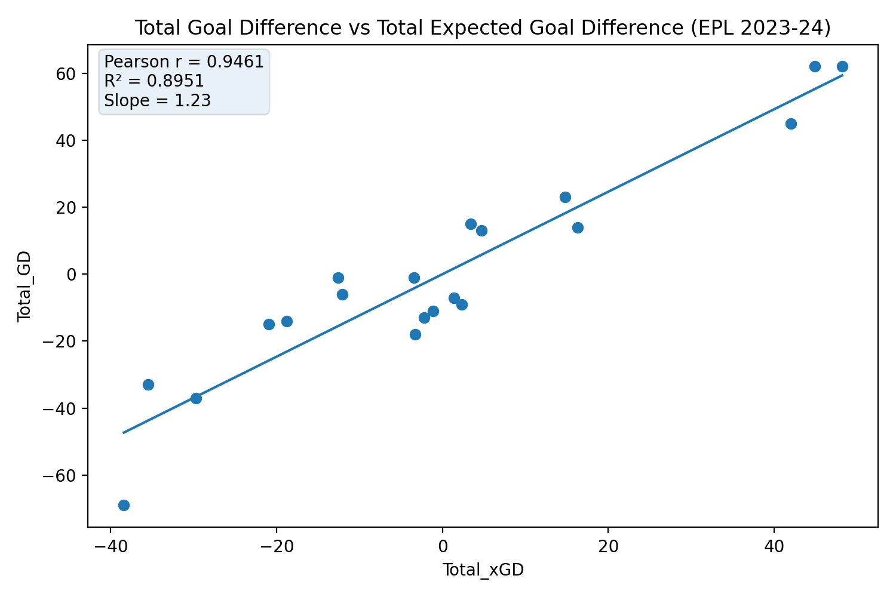
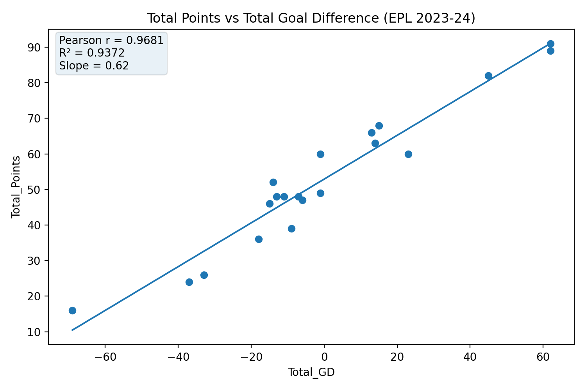
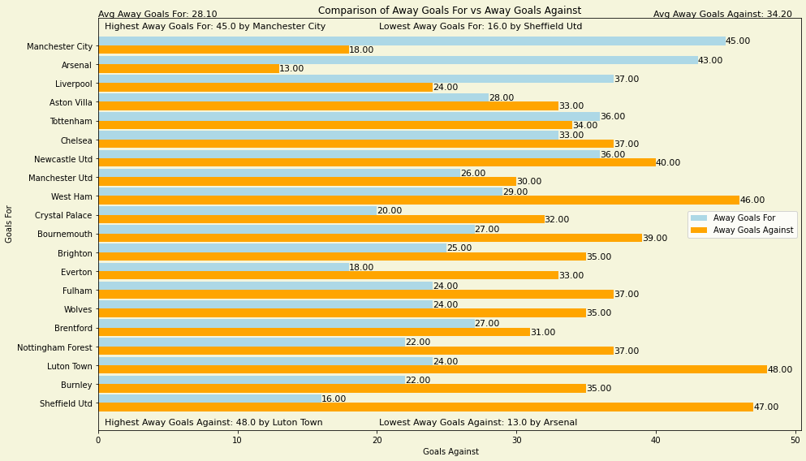

# EPL 2023–24 Season Analysis (Football Analytics)

End-to-end football analytics project on **Premier League 2023–24** team performance using a single season-level dataset with **home/away splits** and **expected goals (xG)** features.

This repository includes the **full written analysis** (the original “cut” section is now integrated into the full report):
- `docs/EPL_23-24_Season_Analysis_Full.docx` (full report)
- `docs/EPL_23-24_Season_Analysis_Main.docx` (original submission version)
- `docs/EPL_23-24_Season_Analysis_CutSection.docx` (original cut text, kept for provenance)

## Analysis questions
1. **How well does expected goal difference (xGD) explain actual goal difference (GD)?**
2. **How strongly are points related to GD and xGD?**
3. **How big is the home advantage (points + xG-based metrics)?**
4. **How do teams differ in attack/defence (Goals For/Against and xG For/Against) at home vs away?**

## Key findings (with reproducible metrics)

### 1) xGD strongly explains GD (season totals)
- Total xGD vs Total GD: **Pearson r ≈ 0.946**
- Linear regression: **R² ≈ 0.895**, slope **≈ 1.23**



### 2) Points are strongly related to GD (and also to xGD)
- Total Points vs Total GD: **r ≈ 0.968**, **R² ≈ 0.937**, slope **≈ 0.62**
- Total Points vs Total xGD: **r ≈ 0.901**, **R² ≈ 0.813**, slope **≈ 0.75**



### 3) Clear home advantage in 2023–24
Across teams (season averages):
- **Home points ≈ 30.35** vs **Away points ≈ 22.55** (**+7.80** points at home)
- **Home GD ≈ +6.10** vs **Away GD ≈ −6.10** (**+12.20** GD swing)

#### Home vs away points (bar chart)


### 4) Attack/defence profiles differ home vs away
The report also compares:
- Goals For vs Goals Against (home & away)
- xG For vs xG Against (home & away)
- Results breakdown (W/D/L) home vs away

A few representative visuals (from the original plotting outputs):





> Note: some “screenshot” figures use club crests inside the plot. If you prefer a fully logo-free public repo, you can delete `outputs/figures/screenshots/` and rely on the reproducible plots from `src/` (which do not require logos).

## Quickstart

```bash
pip install -r requirements.txt
python -m src.run_all
```

Outputs are written to: `outputs/figures/`

## Repository structure
- `src/` – clean, reproducible pipeline (metrics + logo-free plots)
- `scripts/original/` – original coursework plotting scripts (kept as-is)
- `data/` – dataset + provenance notes
- `docs/` – report(s)

## Data
Dataset source is referenced in the report and documented in `data/README.md`.
